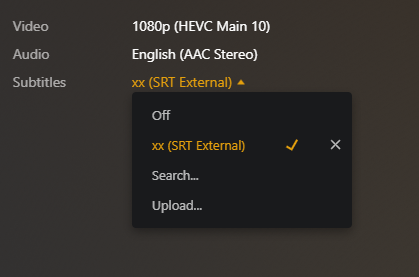
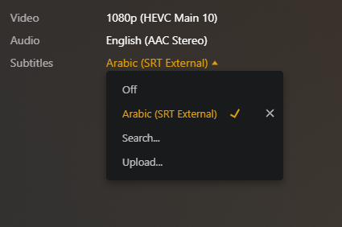

# Subtitles-Renamer

## Description

This shell script is designed to rename all subtitle files in a specified folder to include a language code in their names. This feature is particularly useful when organizing movies or videos with subtitles in multiple languages. The script checks for files with specific extensions (`.srt` and `.ass`) and renames them to include the provided language code as a suffix.

&nbsp;
## Usage/Examples


&nbsp;


&nbsp;
```shell script
chomd +x ./rename_subtitle.sh
```

To make the script executable.

```shell script
./rename_subtitle.sh <language> <folder_path>
```

Replace `<language>` with the language code (e.g., "ar" for Arabic) and `<folder_path>` with the path to the folder containing the files you want to rename. For example:

```shell script
./rename_subtitle.sh ar /Movies/MyMovie
```

Note: The script assumes that the `mv` command is available on your system. If it's not installed or you encounter any issues, please ensure that the command is properly installed and configured before running the script.

&nbsp;
## Options
The script requires two positional arguments:

1 - `<language>`: The language code to be added as a suffix to the files' names (e.g., "ar" for Arabic).

2 - `<folder_path>`: The path to the folder containing the files you want to rename.


&nbsp;
## Behavior

1 - The script checks if the correct number of arguments is provided. If not, it displays the usage instructions.

2 - The `check_rename()` function is responsible for the main functionality of the script. It renames all `.srt` and `.ass` files in the specified folder that do not already contain the provided language code in their names.

3 - Before renaming the files, the script checks if the provided folder path exists and is a valid directory.

4 - If any of the checks fail or if the user does not provide the correct arguments, an error message is displayed, and the script exits with an exit code of 1.

5 - If the folder and language code checks pass, the script proceeds to rename the files using the `mv` command.

6 - The script searches for files with the `.srt` and `.ass` extensions in the specified folder and its subdirectories.

7 - If a file's name does not already contain the provided language code as a suffix, the script renames the file, adding the language code as a suffix in the format `MyMovie.ar.srt` for Arabic subtitles.

8 - The renaming operation uses `echo_then_run()` function to print the command being executed and then actually run it. If you want to test the script without renaming the files, you can uncomment the `echo "$@"` line inside the `echo_then_run()` function.

&nbsp;
## Error Handling

- If the user does not provide the correct number of arguments or any of the provided arguments are empty, the script will display an error message and exit with a status code of 1.

- If the provided folder path does not exist or is not a valid directory, the script will display an error message and exit with a status code of 1.

&nbsp;
## Notes

- This script is specifically designed to rename subtitle files with the `.srt` and `.ass` extensions. If you want to rename files with different extensions or handle other types of files, you may need to modify the script accordingly.

- The script uses the `-u` option in the shebang `(#!/bin/bash)` to exit immediately if any command returns a non-zero status (set -e). It also uses the `-e` option to treat unset variables as an error. Additionally, it uses `set -o pipefail` to propagate the exit status of the last command that returned a non-zero status in a pipeline. These options enhance the script's safety and reliability.

- Please make sure to test the script on a small subset of your files before running it on a large dataset to ensure it behaves as expected.

&nbsp;
## Disclaimer
The script is provided as-is, and the author takes no responsibility for any data loss or damage that may occur as a result of using this script. It is always recommended to review and understand the script before running it on critical data. If you have any concerns or doubts about the script's functionality, seek assistance from a qualified professional.
